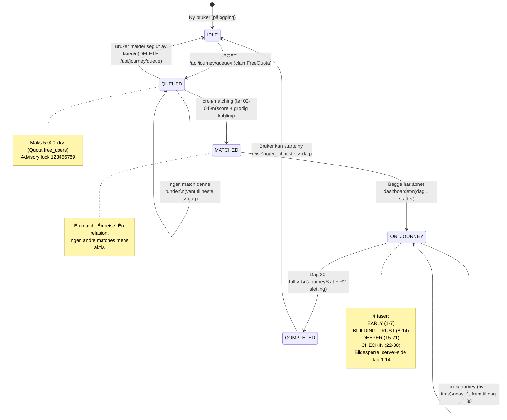
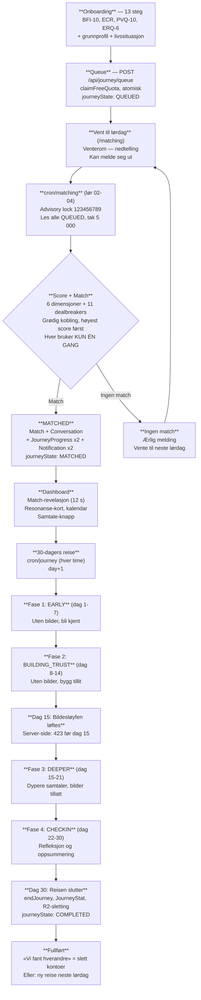
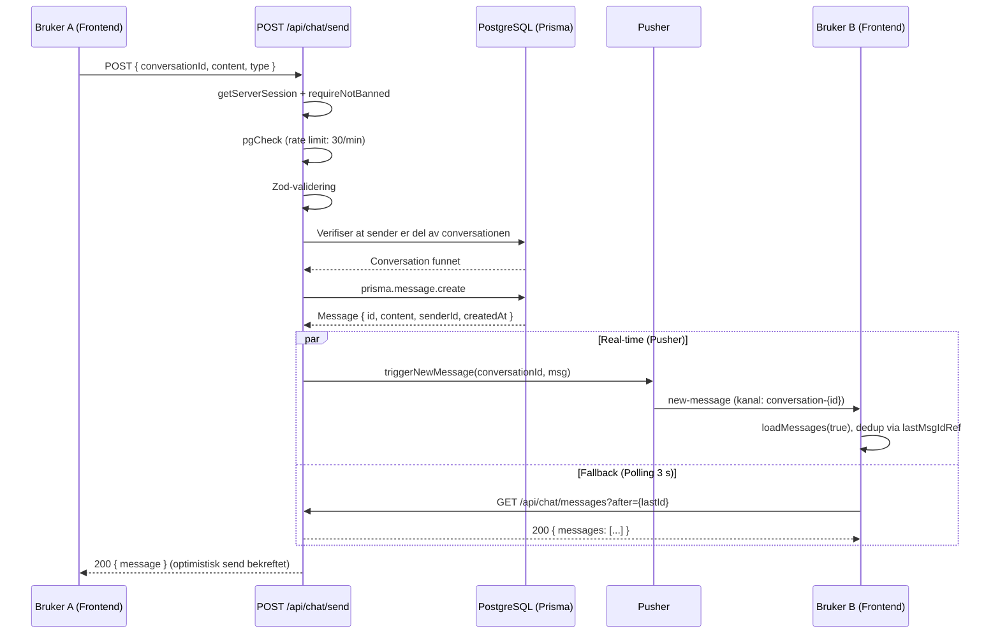
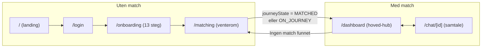
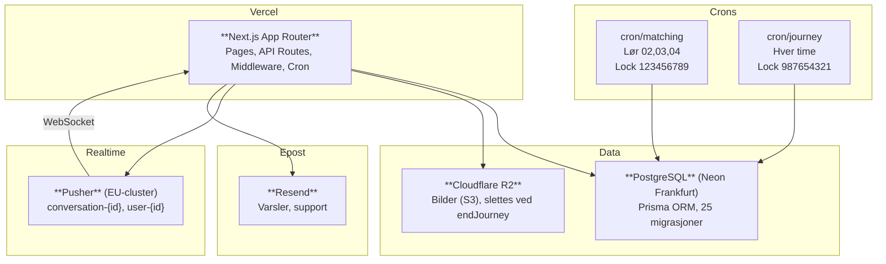

# ToSom — System Flow & Loop (Visuelt referanseverk)

**Dato:** 2026-08-30
**Status:** Referanse. Verifisert mot koden.
**Kilde:** `TOSOM-SUPER-MASTERPLAN-v2.0.md` (kanonisk) + kildekoden.

> Alle diagrammer er mermaid og renderes i GitHub / VS Code.
> Fil-referanser lar deg sjekke hvert steg mot koden.

---

## 1. Brukerreise — Tilstandsmaskin (journeyState)

Hver bruker har én `journeyState` til enhver tid. Overgangene er strengt styrt av server-side cron og API-ruter.

### Overgangsregler (verifisert mot koden)

| Fra | Til | Utløser | Fil |
|-----|-----|---------|-----|
| `IDLE` | `QUEUED` | `POST /api/journey/queue` → `claimFreeQuota()` | `app/api/journey/queue/route.ts` |
| `QUEUED` | `MATCHED` | `cron/matching` (lør 02,03,04) — score + greedy | `app/api/cron/matching/route.ts` |
| `MATCHED` | `ON_JOURNEY` | Begge har besøkt dashboard (dag 1) | `lib/journey/engine.ts` |
| `ON_JOURNEY` | `ON_JOURNEY` | `cron/journey` (hver time) — day+1 | `app/api/cron/journey/route.ts` |
| `ON_JOURNEY` | `COMPLETED` | Dag 30 fullført → `endJourney()` | `lib/journey/engine.ts` |
| `COMPLETED` | `IDLE` | Bruker starter ny reise (neste lørdag) | `POST /api/journey/queue` |
| `QUEUED` | `IDLE` | `DELETE /api/journey/queue` (meld deg ut) | `app/api/journey/queue/route.ts` |

---

## 2. Hovedløkken — Flowchart

Fra onboarding til ferdig reise. Denne løkken er hele ToSom.

### Matchevektene (summerer til 1,00)

| Dimensjon | Vekt | Kilde |
|-----------|------|-------|
| Verdier | 0,25 | PVQ-10 |
| Tilknytning | 0,25 | ECR |
| Personlighet | 0,15 | BFI-10 |
| Kommunikasjon | 0,15 | Kommunikasjonsstil |
| Emosjonsregulering | 0,10 | ERQ-6 |
| Livssituasjon | 0,10 | Livssituasjon + preferanser |

---

## 3. Sekvens — Chat (real-time + fallback)

Hvordan meldingen flyter fra sender til mottaker.

### Pusher-kanaler

| Kanal | Events | Bruk |
|-------|--------|------|
| `conversation-{id}` | `new-message`, `typing`, `mood-changed` | Chat real-time |
| `user-{id}` | `conversation-updated` | Dashboard varsling |

**Filer:** `lib/pusher/client.ts` (frontend) · `lib/pusher/server.ts` (backend)

---

## 4. Ruting — Frontend-sider

Hvordan brukeren flyttes mellom sider basert på tilstand.

### Rutebeskyttelse

| Rute | Beskyttelse | Mekanisme |
|------|-------------|-----------|
| `/api/chat/*` | Session | Middleware → `getToken()` |
| `/api/journey/*` | Session | Middleware → `getToken()` |
| `/api/match/*` | Session | Middleware → `getToken()` |
| `/api/admin/*` | Admin role | `verifyAdminCookie()` + `isAdminRole()` |
| `/dashboard` | Match sjekk | Client-side: `!match → replace('/matching')` |
| `/matching` | Match sjekk | Client-side: `MATCHED → replace('/dashboard')` |
| `/chat/[id]` | Session | Server-side: `!session → redirect('/login')` |

---

## 5. Systemarkitektur

---

## 6. Invarianter — aldri brytes

| # | Invariant | Hvor i flowet | Sikres av |
|---|-----------|---------------|-----------|
| I-1 | Én match per bruker om gangen | Queue → Matching | Grødig kobling |
| I-2 | Matching bruker aldri bilder | Score | `buildCheapFeatures` |
| I-3 | Brukeren velger aldri mellom matcher | Match | Én match, ingen feed |
| I-4 | Ingen push/e-post/SMS ved match | Match | Ingen notification (beta: flagg) |
| I-5 | Reisen er 30 dager, fire faser | Journey | `PHASE_CONFIGS` |
| I-6 | Ingen bilder før dag 15 | Chat | Server-side: 423 |
| I-7 | Ingen AI-tekst mot brukere | Alt | Ingen LLM-kall |
| I-8 | Ingen feed, swipe, gamification | Frontend | CI-vakt: `verify:concept` |
| I-9 | Profilen er privat | Matching | Ingen API-rute deler profil |
| I-10 | Matching ukentlig, natt til lørdag | Cron | Vercel Cron + lock |
| I-11 | Uten match → vent til neste lørdag | Venterom | Ingen manual-match |
| I-12 | Brukeren ser ord, aldri tall | Frontend | «Sterk resonans» |
| I-13 | «Vi fant hverandre» sletter kontoer | Endreise | `endJourney()` |
| I-14 | Aldersgrense 21+ | Onboarding | `MIN_AGE = 21` |

**Kilde:** `docs/TOSOM-SUPER-MASTERPLAN-v2.0.md` §16

---

## 7. CI-vaktene

| Vakt | Sjekker |
|------|---------|
| `verify:lang` | Ingen nynorsk (640 filer) |
| `verify:ai` | Ingen AI-tekstgenerering mot brukere |
| `verify:concept` | Ingen feed/swipe/gamification |
| `verify:one-engine` | Én matching-motor |
| `verify:cron-05` | Cron autorisert + advisory lock |
| `verify:cron` | Cron-ruter har korrekt signatur |

---

## 8. Filsjekk

| Komponent | Hovedfiler |
|-----------|-----------|
| Onboarding | `app/onboarding/OnboardingFlow.tsx` |
| Queue | `app/api/journey/queue/route.ts`, `lib/payment/freeQuota.ts` |
| Matching-cron | `app/api/cron/matching/route.ts` |
| Score | `lib/matching/unifiedScorer.ts`, `lib/matching/dealbreaker.ts` |
| Journey-cron | `app/api/cron/journey/route.ts` |
| Journey-engine | `lib/journey/engine.ts` |
| Chat (send) | `app/api/chat/send/route.ts` |
| Chat (read) | `app/api/chat/messages/route.ts` |
| Chat (context) | `app/chat/context/ChatContext.tsx` |
| Pusher | `lib/pusher/client.ts`, `lib/pusher/server.ts` |
| Session | `lib/auth/session.ts` |
| Middleware | `middleware.ts` |
| Dashboard | `app/dashboard/page.tsx` |
| Venterom | `app/matching/page.tsx` |

---

*Levende referanseverk. Oppdater ved endring i flow. Koden vinner alltid — finner du avvik: rapporter det.*